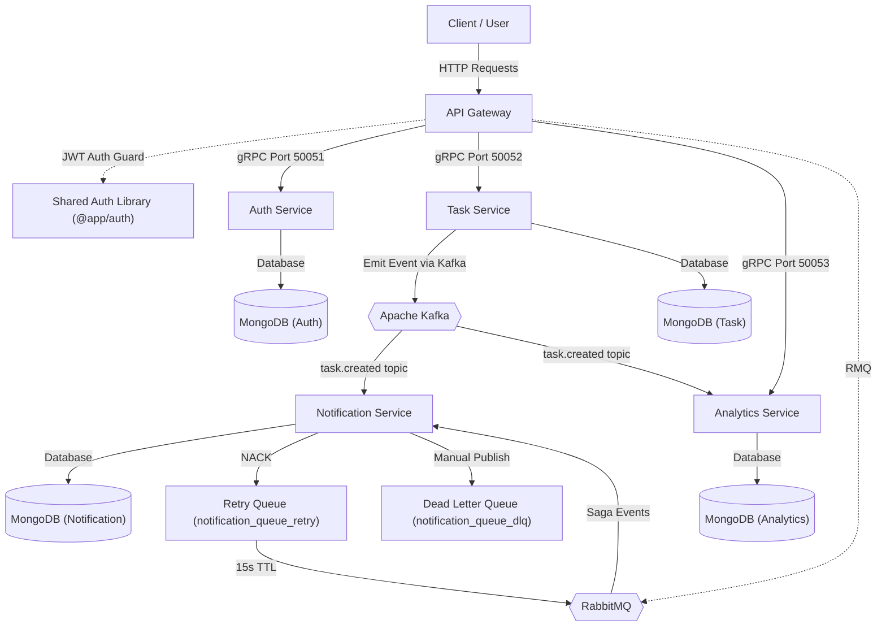

# 🏗️ WorkflowHub

<p align="center">
  
</p>

<p align="center">
  <strong>A premium, enterprise-grade event-driven workflow management system built with NestJS microservices.</strong>
</p>

<p align="center">
  <a href="https://nestjs.com/" target="_blank"></a>
  <a href="https://grpc.io/" target="_blank"></a>
  <a href="https://www.rabbitmq.com/" target="_blank"></a>
  <a href="https://kafka.apache.org/" target="_blank"></a>
  <a href="https://redis.io/" target="_blank"></a>
  <a href="https://www.mongodb.com/" target="_blank"></a>
  <a href="https://opentelemetry.io/" target="_blank"></a>
  <a href="https://jaegertracing.io/" target="_blank"></a>
  <a href="https://prometheus.io/" target="_blank"></a>
  <a href="https://grafana.com/" target="_blank"></a>
  <a href="https://kubernetes.io/" target="_blank"></a>
</p>

---

## 📌 Repository Description (for GitHub About section)

```text
WorkflowHub is an event-driven workflow system built with NestJS. Features: gRPC, RabbitMQ/Kafka hybrid messaging, Sagas, Transactional Outbox, Redis rate limiting/idempotency, Opossum circuit breakers, Prometheus/Jaeger, and Kubernetes.
```

---

## 🏗️ System Architecture

The following diagram illustrates the high-level system layout, communications, and message flows:



---

## 🗂️ Monorepo Projects Summary

The monorepo contains the following workspace projects:

| Project Name             | Type           | Database / Ports / Protocols                    | Description                                                                                                                       |
| :----------------------- | :------------- | :---------------------------------------------- | :-------------------------------------------------------------------------------------------------------------------------------- |
| **api-gateway**          | Application    | HTTP Port `3000`                                | Gateway entrypoint routing client requests to backend microservices via gRPC (Auth/Task/Analytics) and RabbitMQ (Saga Rollbacks). |
| **auth-service**         | Application    | MongoDB (Auth) / gRPC Port `50051`              | Handles user authentication, bcrypt password hashing, and token issuance via gRPC.                                                |
| **task-service**         | Application    | MongoDB (Task) / gRPC Port `50052` / Kafka      | Manages task creation via gRPC and emits task events to Apache Kafka using the Transactional Outbox Pattern.                     |
| **notification-service** | Application    | MongoDB (Notification) / RMQ & Kafka            | Consumes event messages from RabbitMQ (Sagas) and Apache Kafka (Task events) to create user notifications.                        |
| **analytics-service**    | Application    | MongoDB (Analytics) / gRPC Port `50053` / Kafka | Tracks total task counters per user by consuming task events from Apache Kafka in parallel.                                       |
| **auth (Library)**       | Shared Library | N/A                                             | Shared utility library for JWT signature verification and Route Guards.                                                           |
| **shared (Library)**     | Shared Library | N/A                                             | Centralized utility library for RabbitMQ topology setup, Kafka configurations, gRPC proto files, and logging/correlation helpers. |

---

## 🚀 Key Features

### 1. High-Performance Synchronous Communication (gRPC)
*   Communication between **API Gateway** and downstream services (**Auth**, **Task**, and **Analytics**) is powered by **gRPC** (HTTP/2) for low-overhead, synchronous communication.
*   Uses Protocol Buffers (Protobuf) for type-safe contract definition.

### 2. Hybrid Asynchronous Messaging (RabbitMQ + Kafka)
*   **Apache Kafka (KRaft mode)** is used for high-throughput, parallel event streaming (e.g., broadcasting `task.created` events to both **Notification** and **Analytics** services).
*   **RabbitMQ** is used for transaction coordination and saga compensation events.

### 3. Distributed Transactions (Orchestrated Saga Pattern)
*   User registration spans multiple microservices in an **Orchestrated Saga** managed by `RegistrationSagaService` in the API Gateway.
*   If registration fails at any step, compensating transactions run in reverse order (`notification.deleteSaga`, `task.deleteSaga`, `auth.deleteUser`) to maintain eventual consistency.

### 4. Reliable Event Publishing (Transactional Outbox Pattern)
*   Resolves the dual-write problem in the **Task Service**.
*   Tasks and outbox event records are saved atomically inside a **MongoDB Transaction** (backed by a replica set).
*   A background `OutboxPollerService` reliably polls and publishes events to Kafka with an automatic retry limit and a Time-To-Live (TTL) index for data pruning.

### 5. Resiliency (Opossum Circuit Breakers)
*   API Gateway wraps gRPC client calls dynamically with **Opossum circuit breakers** to prevent cascading failures.
*   Includes error filtering to prevent business validation issues from tripping the breaker, custom state change logging, and passive evaluation to handle high traffic.

### 6. Full Observability & Monitoring Stack
*   **Trace Correlation**: Injects `x-correlation-id` at the gateway, propagates it over RMQ and gRPC, and tags all logs.
*   **Distributed Tracing**: Auto-instrumented using the Node **OpenTelemetry SDK** and exported to **Jaeger** for queryable, end-to-end timeline tracing.
*   **Metrics Scraping**: **Prometheus** scrapes API Gateway HTTP request latencies and response statuses.
*   **Dashboards**: **Grafana** plots request metrics in real-time.

### 7. API Gateway Rate Limiting & Security
*   **Redis-backed Distributed Throttling**: Implemented using `RedisThrottlerGuard` to enforce request caps across scaled gateway containers.
*   Supports adaptive client identification (UserId for logged-in users, IP address for anonymous visitors).

### 8. Message Deduplication (Redis Idempotency)
*   Notification and Analytics services use Redis-based atomic check-and-set locks (`event:${taskId}`) to detect and skip duplicate events safely.

---

## 🛠️ Local Development & Setup

### Prerequisites
*   Node.js (v18+)
*   Docker & Docker Compose

### 1. Environment Configuration
Create a `.env` file in the root directory (you can copy `.env.example` if available) and configure your database, Redis, RabbitMQ, and Kafka URLs.

### 2. Run the Stack
Start all databases, brokers, tracing tools, and microservices in development mode:
```bash
docker-compose up --build
```

This launches:
*   **API Gateway**: `http://localhost:3000`
*   **RabbitMQ Management**: `http://localhost:15672` (Guest / Guest)
*   **Jaeger UI**: `http://localhost:16686`
*   **Grafana**: `http://localhost:3001`
*   **Prometheus**: `http://localhost:9090`
*   **MongoDB Instances**: Auth, Task, Notification, and Analytics dbs.
*   **Redis & Kafka**: Core infrastructure services.

### 3. Compile and Run Local Node Development Server
If you want to run services locally (outside Docker) during development:
```bash
# Install dependencies
npm install

# Run the API Gateway in watch mode
npm run start:dev api-gateway

# Run any microservice (e.g. task-service)
npm run start:dev task-service
```

### 4. Running Tests
```bash
# Run unit tests
npm run test

# Run e2e tests
npm run test:e2e
```

### 5. Kubernetes Orchestration (Upcoming / In-Progress)
The application architecture is fully prepared for container orchestration via **Kubernetes**:
*   **Scalability**: Deploy and horizontally auto-scale microservices (HPA) like `api-gateway`, `task-service`, and `notification-service` dynamically.
*   **Config & Secret Management**: Configure service databases, RabbitMQ, Kafka, and Redis credentials using Kubernetes ConfigMaps and Secrets.
*   **Service Discovery & Ingress**: Route public client requests through an Ingress Controller to the API Gateway.
