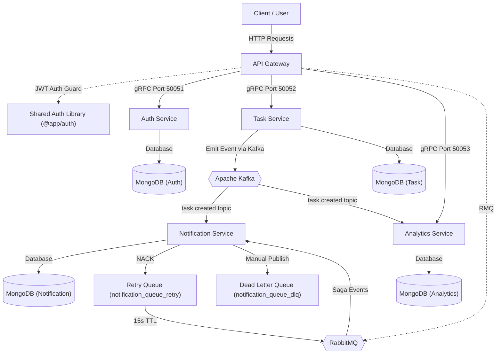

# WorkflowHub: Project Architecture & Microservices Documentation

WorkflowHub is an event-driven workflow management system built with NestJS microservices in a monorepo architecture.

---

## 🏗️ System Architecture

The diagram below illustrates the high-level system layout and communications:



---

## 🗂️ Monorepo Projects Summary

The monorepo contains the following workspace projects:

| Project Name             | Type           | Database / Ports / Protocols                    | Description                                                                                                                       |
| :----------------------- | :------------- | :---------------------------------------------- | :-------------------------------------------------------------------------------------------------------------------------------- |
| **api-gateway**          | Application    | HTTP Port `3000`                                | Gateway entrypoint routing client requests to backend microservices via gRPC (Auth/Task/Analytics) and RabbitMQ (Saga Rollbacks). |
| **auth-service**         | Application    | MongoDB (Auth) / gRPC Port `50051`              | Handles user authentication, bcrypt password hashing, and token issuance via gRPC.                                                |
| **task-service**         | Application    | MongoDB (Task) / gRPC Port `50052` / Kafka      | Manages task creation via gRPC and emits task events to Apache Kafka.                                                             |
| **notification-service** | Application    | MongoDB (Notification) / RMQ & Kafka            | Consumes event messages from RabbitMQ (Sagas) and Apache Kafka (Task events) to create user notifications.                        |
| **analytics-service**    | Application    | MongoDB (Analytics) / gRPC Port `50053` / Kafka | Tracks total task counters per user by consuming task events from Apache Kafka in parallel.                                       |
| **auth (Library)**       | Shared Library | N/A                                             | Shared utility library for JWT signature verification and Route Guards.                                                           |
| **shared (Library)**     | Shared Library | N/A                                             | Centralized utility library for RabbitMQ topology setup, Kafka configurations, gRPC proto files, and logging/correlation helpers. |

---

## 🛡️ Reliability & RabbitMQ Queue Design

To guarantee robust message handling and zero data loss, the messaging architecture integrates the following reliability features:

### 1. Message Durability

- **Durable Queues**: All microservice queues (`auth_queue`, `task_queue`, `notification_queue`) are configured with `durable: true`. This ensures queues survive broker restarts.
- **Persistent Messages**: Messages published across services are marked as persistent, guaranteeing they are written to disk.

### 2. Manual Acknowledgment (ACK / NACK)

- The Notification Service utilizes manual acknowledgment rather than automatic acknowledgement (`noAck: false`).
- **ACK (Success)**: On successful database persistence, the consumer manually sends an `ack` to remove the message from the queue.
- **NACK (Failure)**: On processing failure, the consumer issues a `nack` with `requeue: false`. RabbitMQ automatically routes this rejected message to the configured dead-letter exchange (`retry.exchange`), placing it in the retry queue instead of retrying infinitely in a tight loop.

### 3. Dead Letter Queue (DLQ)

- The `notification_queue` is configured to dead-letter to `retry.exchange` with routing key `notification_queue_retry` on failure.
- If a message's retry count reaches **3**, it is considered permanently failed. The consumer manually publishes the message to the DLQ exchange (`dlq.exchange`) with routing key `notification_queue_dlq` and sends an `ack` to the main queue to safely quarantine the message.

### 4. Retry Mechanism (TTL / Delay Queue)

- When a message is dead-lettered due to `nack(message, false, false)`:
  - It routes to `notification_queue_retry` through the `retry.exchange`.
  - The retry queue holds the message for a Time-To-Live (TTL) of **15 seconds** without any active consumers.
  - Once the TTL expires, the retry queue's dead letter configuration (`x-dead-letter-exchange: notification.exchange`, `x-dead-letter-routing-key: notification_queue`) routes the message back to the main queue for another processing attempt.

### 5. Consumer-Level Idempotency (Redis Cache)

To prevent duplicate processing of event messages due to network retries, connection drops, or worker restarts, the Notification Service implements **consumer-level idempotency** using a Redis cache:

- **Atomic Check-and-Set**: When a `task.created` event is received, the consumer executes an atomic Redis write: `redis.set(key, 'processed', 'EX', 86400, 'NX')` where the key is `event:${taskId}` (lasting 24 hours).
- **Duplicate Skip**: If the key is already set (Redis returns `null` instead of `'OK'`), the message is recognized as a duplicate, logged, immediately acknowledged (`ack`), and skipped.
- **Failure Eviction**: If notification creation throws an exception, the lock is evicted from Redis (`redis.del(key)`) to allow a subsequent retry attempt to proceed safely.

---

## 🧪 Testing Idempotency

Verification of consumer-level idempotency can be performed manually:

1. **Prepare Payload**: Wrap the event payload in NestJS microservice wrapper format:
   ```json
   {
     "pattern": "task.created",
     "data": {
       "userId": "6a378c81035df210e3def929",
       "taskId": "6a37a1a4d2a1dba2aa29f8a1",
       "title": "Task 1",
       "message": "Task Created Successfully",
       "type": "EMAIL"
     }
   }
   ```
2. **First Publish**: Publish this payload to the `notification_queue` using the RabbitMQ Management Portal (`http://localhost:15672`).
   - **Result**: Consumer processes the message and sets the Redis key.
3. **Second Publish**: Publish the identical payload again.
   - **Result**: Consumer intercepts the duplicate `taskId`, logs `Duplicate event detected for taskId: 6a37a1a4d2a1dba2aa29f8a1. Skipping processing.`, and immediately `ack`s the message without saving it again to MongoDB.

---

## 🏢 Idempotency in Production Architectures

In major enterprise applications (such as Stripe, Uber, or Netflix), idempotency is designed at key points:

- **Write/Transactional Barriers**: Idempotency is applied to write/side-effect operations (like charging credit cards, generating bookings, sending notifications) rather than reads (which are naturally idempotent).
- **Idempotency-Key Header**: HTTP API endpoints expect a client-generated `Idempotency-Key` header (e.g. UUID). The request is intercepted, checked against Redis/Database, and cached responses are served directly if a duplicate is sent.
- **Middleware & Decorators**: Logic is modularized using Decorators (`@Idempotent()`) or API Gateway interceptors to keep code DRY across services.
- **Unique Constraints**: A fallback unique database constraint on key fields (like `taskId`) is maintained to safeguard against database race conditions.

---

## 🔄 Distributed Transactions & Saga Patterns

Instead of traditional, blocking distributed transactions (like 2-Phase Commit), WorkflowHub implements the **Saga Pattern** for eventual consistency:

### 1. Choreographed Saga (Decentralized)

Currently implemented for **Task Creation**:

- **Happy Path**: `task-service` creates a task and publishes `task.created` to RabbitMQ $\rightarrow$ `notification-service` consumes it and saves the notification.
- **Idempotency**: Consumer-level idempotency prevents duplicate processing via Redis locks.

### 2. Orchestrated Saga (Centralized - Implemented)

Implemented for **User Registration**:

- **Coordinator**: A central Orchestrator (`RegistrationSagaService` in `api-gateway`) coordinates execution.
- **Happy Path**: Creates User (`auth-service`) $\rightarrow$ Creates Welcome Task (`task-service` via `task.createSaga` silently) $\rightarrow$ Sends Welcome Notification (`notification-service` via `notification.sendSaga`).
- **Compensating Transactions (Rollback)**: In case of step failure, rollback actions execute in reverse order (`notification.deleteSaga`, `task.deleteSaga`, `auth.deleteUser`) to revert completed steps, preserving eventual consistency.

---

## 📥 Transactional Outbox Pattern (Reliable Event Publishing)

To resolve the **Dual Write** problem during task creation (where writing to MongoDB and publishing to Kafka could fail independently), we implemented the Transactional Outbox Pattern in the Task Service:

### 1. Atomic Writes (MongoDB Transactions)

- Rather than emitting events to Kafka during the HTTP/gRPC request cycle, the task creation handler writes both the task business document and a corresponding event message into an `Outbox` collection.
- Both writes are executed within a single MongoDB session transaction (`session.startTransaction()`). This guarantees that either both writes succeed or both fail, preventing lost events or inconsistent downstream states.
- MongoDB transactions require replica sets, which was enabled in `docker-compose.yml` for the `mongo-task` container.

### 2. Asynchronous Outbox Worker/Poller

- An interval-based background service (`OutboxPollerService`) polls the `Outbox` collection every 5 seconds for `PENDING` events.
- It attempts to publish each event to Kafka using `this.kafkaClient.emit()`.
- On a successful publish, the event is marked `COMPLETED` and timestamped.
- If a publish attempt fails (e.g., Kafka is temporarily down), the poller catches the error gracefully, increments the `attempts` count, and retries on the next poll. If it fails 25 consecutive times, the event is quarantined with a `FAILED` status to prevent head-of-line blocking.

### 3. Automatic Data Pruning (TTL Index)

- To prevent database bloat, a TTL (Time-To-Live) index is configured on the `processedAt` field in the `Outbox` collection schema.
- MongoDB automatically purges all completed or permanently failed outbox documents 7 days after their `processedAt` timestamp is set.

### 4. File References

- **Schema**: [outbox.schema.ts]
- **Poller Service**: [outbox-poller.service.ts]
- **Task Service**: [task.service.ts]
- **Task Module**: [task.module.ts]

---

## 🛡️ API Gateway Security & Rate Limiting

To safeguard the application from denial-of-service (DDoS), credential stuffing, and brute-force attacks, the API Gateway incorporates custom rate limiting:

### 1. Redis-Backed Distributed Throttling

- **Atomic Metering**: Implemented via `RedisThrottlerGuard` which intercepts HTTP requests and uses the atomic Redis command `INCR` along with `EXPIRE` to track request limits in a fixed-time window.
- **Distributed State**: State is stored in a shared Redis instance rather than in-memory. This ensures rate limits remain consistent even when the API Gateway container scales horizontally.
- **Adaptive Client Identification**:
  - **Authenticated Users**: Uses their unique `userId` (`user:<id>`) as the tracking identifier.
  - **Anonymous Users**: Falls back to the client's public IP address (`ip:<ip>`), safely parsing headers like `x-forwarded-for` to support deployment environments behind reverse proxies.

### 2. Fine-Grained Adjustments via Decorators

- **Global Default**: Standard routes default to rate thresholds defined in environment variables (e.g. `API_GATEWAY_THROTTLE_LIMIT=10`, `API_GATEWAY_THROTTLE_TTL=60`).
- **Overriding Limits**: Routes can be decorated with `@Throttle(limit, ttl)` to scale limits up (e.g., higher caps for batch fetch) or down (e.g., strict caps like 3 requests per minute for `/auth/login` to prevent brute-forcing).

### 3. Global Request Validation & Sanitization (Shared DTOs)

- **Validation Pipeline**: API Gateway registers a global `ValidationPipe` to validate HTTP body payloads.
- **Whitelisting & Rejection**: Enforces `whitelist: true` and `forbidNonWhitelisted: true` to sanitize input data and block unexpected request fields (preventing parameter-injection attacks).
- **Shared DTO Library**: DTOs (`RegisterDto`, `LoginDto`, `TaskDto`) reside in the shared `@app/shared` library, ensuring the API Gateway and downstream microservices share a single source of truth for validation rules.

---

## 🌐 API Versioning & Route Prefixing

To support clean API lifecycle management and avoid breaking existing clients, WorkflowHub implements URL-based API versioning at the gateway level:

### 1. Global URI-Based Versioning

- **Global Prefix**: Configured via `app.setGlobalPrefix('api')` so that all routes reside under the `/api` namespace.
- **URI Versioning**: Enabled via `app.enableVersioning({ type: VersioningType.URI })`. This automatically parses and matches route versions in the request URL (e.g., `/api/v1/...`).

### 2. Explicit Controller-Level Versioning

- Gateway controllers specify their API versions explicitly using the `@Controller` decorator options:
  - **Auth**: `@Controller({ path: 'auth', version: '1' })` (serves `/api/v1/auth/...`)
  - **Tasks**: `@Controller({ path: 'task', version: '1' })` (serves `/api/v1/task/...`)
  - **Analytics**: `@Controller({ path: 'analytics', version: '1' })` (serves `/api/v1/analytics/...`)
- Unversioned endpoints (such as the gateway's root health-check endpoint `GET /api`) remain version-neutral and bypass version prefixes.

### 3. Environment-Independent Path Resolution

- To ensure E2E test suites run successfully without path failures, gRPC module configurations resolve `.proto` paths using `process.cwd()` (the workspace root) rather than relative `__dirname` paths (which resolve differently in Jest vs Webpack).
  - Example: `join(process.cwd(), 'libs/shared/src/proto/auth.proto')`

---

## 🐳 Containerization & Orchestration

The entire service stack is containerized for seamless local development:

- **Docker Multi-Stage Builds**: Each application features an optimized `Dockerfile` leveraging Alpine Node images to keep production images lightweight.
- **Docker Compose Orchestration**: Configures local host ports mapping for databases and the gateway, dependencies (`depends_on`), environment configuration via `.env` files, and named volumes mapping for Mongo data persistence (`mongo_auth_data`, `mongo_task_data`, and `mongo_notification_data`).

---

## 📊 Observability, Logging & Metrics

To monitor system health and track requests across microservices, the system implements a multi-tiered observability stack:

### 1. Centralized Logging & Correlation IDs

- **Request Tracing**: Incoming HTTP requests at the **API Gateway** are assigned a unique `x-correlation-id` via the `HttpCorrelationMiddleware` (using Node's `AsyncLocalStorage`).
- **RMQ Propagation**: When the gateway publishes to RabbitMQ, `CorrelationIdClientRmq` automatically injects the correlation ID into the message's `_metadata`.
- **Consumer Processing**: The downstream microservices' `RpcCorrelationIdInterceptor` extracts the correlation ID, binds it to the current context, and strips the metadata before the handler receives the payload.
- **AppLogger**: All console logs are formatted as `[CorrelationID: <UUID>] <Message>` for easy cross-service trace aggregation.

### 2. Metrics & Scraping (Prometheus)

- **Engine Scraping**: A Prometheus container is configured in `docker-compose.yml` to scrape system and runtime metrics from the `/metrics` endpoint every 5 seconds.
- **Custom Metrics**: A global `MetricsInterceptor` tracks all API Gateway HTTP request latencies and response statuses via `http_request_duration_seconds` histogram metrics.

### 3. Visualization Dashboards (Grafana)

- **Visual Analytics**: A Grafana container is running on port `3001` with a pre-configured Prometheus data source (`grafana-datasource.yml`) to plot HTTP request count and latency graphs in real-time.

### 4. Distributed Tracing (OpenTelemetry & Jaeger)

- **Auto-Instrumentation**: Standard Node OTel SDK is initialized at the start of all applications (`tracer.ts`), auto-instrumenting outbound HTTP requests, Express routes, MongoDB operations, and RabbitMQ message flows.
- **Trace Visualization**: Traces are exported over gRPC to a **Jaeger** collector container, allowing developers to query and visually inspect the execution timeline of request chains across microservices.

---

## 📡 Service Discovery & Routing

WorkflowHub relies on decentralized, cloud-native mechanisms for service discovery and routing, eliminating the need for heavy external discovery registries (like Consul or ZooKeeper):

### 1. Broker-Based Message Routing (RabbitMQ)

- **Decoupled Architecture**: Microservices do not communicate directly with each other's IP addresses. Instead, they register consumers and publish events/messages to the centralized **RabbitMQ** broker.
- **Queue/Exchange Abstraction**: RabbitMQ handles message routing and load balancing internally via defined queues and exchanges.

### 2. DNS-Based Internal Resolution (Docker Compose Network)

- **Automatic IP Resolution**: Within the `backend` Docker network, Docker's built-in DNS server automatically routes requests targeted at a service name (e.g. `http://auth-service` or `mongodb://mongo-task`) to the appropriate container's IP address.

### 3. gRPC Client Discovery

- **Direct Synchronous Channels**: For real-time requests (Login, Register, Creating Tasks, Saga coordination), the `api-gateway` communicates directly with the downstream services over HTTP/2 using gRPC client proxies targeting `auth-service:50051` and `task-service:50052`.

---

## ⚡ gRPC Migration Quick Revision Guide

Here is a summary of how gRPC was implemented in this monorepo for quick revision:

### 1. Protobuf Definitions (`libs/shared/src/proto`)

- Created `auth.proto` and `task.proto` defining RPC services, messages, and payloads.
- Mapped MongoDB `_id` keys to `id` fields in `.proto` files since Protobuf fields cannot start with an underscore (`_`).

### 2. Service Migration (`auth-service` & `task-service`)

- Converted bootstrappers (`auth-service` `main.ts` & `task-service` `main.ts`) to start pure gRPC servers (`Transport.GRPC`) using `NestFactory.createMicroservice`.
- Replaced `@MessagePattern` handlers with `@GrpcMethod` handlers in controllers.

### 3. API Gateway Integration (`api-gateway`)

- Registered gRPC clients in `auth.module.ts` and `task.module.ts` using `ClientsModule`.
- Resolved `TS1272` compilation issues by importing `ClientGrpc` as a type (`import type { ClientGrpc }`).
- Implemented `OnModuleInit` to fetch the client service interface stubs and call gRPC methods synchronously (using `firstValueFrom` to handle RxJS Observables).

### 4. Cross-Cutting Concerns & Logging Context

- **Correlation IDs**: Gateway injects the request's correlation ID into the gRPC `Metadata` header (`x-correlation-id`). The server-side `RpcCorrelationIdInterceptor` extracts the header and locks it into the service's `AsyncLocalStorage` context to ensure trace logs remain connected.
- **OTel / Jaeger Tracing**: Automatically instrumented and propagated across gRPC calls out-of-the-box by OpenTelemetry Auto-Instrumentations.

## ⚡ Apache Kafka Setup & Hybrid Event Streaming

To stream task events asynchronously, we integrated Apache Kafka alongside RabbitMQ, running a hybrid broker setup:

### 1. Multi-Listener Kafka Broker (KRaft Mode)

- **Consensus**: Configured in KRaft mode utilizing the official `apache/kafka:3.7.0` container, completely ZooKeeper-less.
- **Port Mapping**: Exposes port `9092` for local host client communication and `9093` inside the Docker network.
- **Voters**: Resolves raft metadata consensus internally at `1@localhost:9091` to avoid startup DNS timeout delays.

### 2. Multi-Microservice Hybrid Bootstrapping

In the Notification Service [main.ts](file:///Users/rajeshbopparthi/Documents/WorkflowHub/workflowhub/apps/notification-service/src/main.ts), we connect multiple microservices to allow simultaneous consumption:

- Uses `app.connectMicroservice()` to register both RabbitMQ (for gRPC saga operations) and Kafka (for asynchronous events).
- Calls `await app.init()` explicitly before `app.startAllMicroservices()` to force execution of the NestJS provider lifecycle hooks (`onModuleInit()`) so that the Redis client connects successfully prior to receiving events.

### 3. Kafka Producer & Consumer Integration (Pub/Sub Broadcast)

- **Producer (Task Service)**: Injects `ClientKafka` and publishes event payload directly using `this.kafkaClient.emit('task.created', data)` inside [task.service.ts](file:///Users/rajeshbopparthi/Documents/WorkflowHub/workflowhub/apps/task-service/src/task/task.service.ts).
- **Parallel Consumers (Pub/Sub Broadcast)**:
  - **Notification Service**: Registers `@EventPattern('task.created')` inside [notification-service.controller.ts](file:///Users/rajeshbopparthi/Documents/WorkflowHub/workflowhub/apps/notification-service/src/notification-service.controller.ts) under consumer group `notification-group`.
  - **Analytics Service**: Registers `@EventPattern('task.created')` inside [analytics-service.controller.ts](file:///Users/rajeshbopparthi/Documents/WorkflowHub/workflowhub/apps/analytics-service/src/analytics-service.controller.ts) under consumer group `analytics-group`.
  - Both services receive their own independent copy of every `task.created` event published by the task service, demonstrating the parallel broadcast pattern.
- **Idempotency Locks & Redis Prefixes**:
  - Because multiple consumer services connect to the same shared Redis cache for event deduplication, key prefixes are used to avoid crosstalk.
  - Notification Service uses `event:${taskId}` while Analytics Service uses `analytics:event:${taskId}` to keep key namespaces isolated.

---

## 🔒 Distributed Locking (Conceptual & Demo Implementation)

While not actively implemented in WorkflowHub, distributed locks are essential for guaranteeing transactional safety across multiple service replicas (e.g., preventing concurrent quota bypasses or duplicate background cron runs).

### 1. Programmatic Lock Service

Using your existing `RedisService` (built on `ioredis`), you can acquire and release locks using the atomic `SET` command with options `NX` (Not Exists) and `PX` (Expiration in milliseconds):

```typescript
import { Injectable } from '@nestjs/common';
import { RedisService } from './redis.service';

@Injectable()
export class RedisLockService {
  constructor(private readonly redisService: RedisService) {}

  async acquireLock(key: string, ttlMs: number): Promise<boolean> {
    const client = this.redisService.getClient();
    // PX: millisecond TTL, NX: only set key if it doesn't already exist
    const result = await client.set(`lock:${key}`, 'locked', 'PX', ttlMs, 'NX');
    return result === 'OK';
  }

  async releaseLock(key: string): Promise<void> {
    const client = this.redisService.getClient();
    await client.del(`lock:${key}`);
  }
}
```

### 2. Guarding a Critical Path (e.g., Task Quota Limits)

To serialize execution per user (e.g., guaranteeing a maximum of 10 tasks under concurrent spam requests):

```typescript
@Injectable()
export class TaskService {
  constructor(
    private readonly lockService: RedisLockService,
    private readonly taskRepository: TaskRepository,
  ) {}

  async createTask(userId: string, data: any) {
    const lockKey = `create-task:${userId}`;
    const acquired = await this.lockService.acquireLock(lockKey, 5000); // 5-second TTL safety net

    if (!acquired) {
      throw new ConflictException(
        'Another task creation is already in progress. Please retry.',
      );
    }

    try {
      // 1. Perform limit check
      const count = await this.taskRepository.countByUserId(userId);
      if (count >= 10) {
        throw new BadRequestException('Task creation quota exceeded.');
      }

      // 2. Create the task
      return await this.taskRepository.create(userId, data);
    } finally {
      // 3. Always release the lock in the finally block
      await this.lockService.releaseLock(lockKey);
    }
  }
}
```

---

## 🌐 The CAP Theorem & Architectural Trade-offs

The **CAP Theorem** states that in any distributed system, you can only guarantee two out of the three properties: **Consistency (C)**, **Availability (A)**, and **Partition Tolerance (P)**.

Since network partitions (P) are an inevitable reality of cloud infrastructure, distributed systems must choose to prioritize either **Consistency (CP)** or **Availability (AP)**.

### 1. WorkflowHub's Choice: Availability & Partition Tolerance (AP)

WorkflowHub prioritizes **AP (Availability & Partition Tolerance)** with **Eventual Consistency** rather than strict, synchronous Consistency (CP).

If a downstream service or database crashes or experiences a network lag (a Partition event):

- The system remains **Available**: Users can still successfully log in, register, and create tasks.
- The system becomes **Eventually Consistent**: Services publish events asynchronously (via Kafka and RabbitMQ). Once the failing services or databases recover, they process the queued events, and the entire system syncs up.

### 2. How and Where this is Implemented in Code

#### A. Eventual Consistency via Asynchronous Event Streaming (Kafka)

In [task.service.ts], when a task is created, the system publishes a `task.created` event asynchronously using `this.kafkaClient.emit()`.

- **AP Benefit**: The Task Service does not block or wait for the `notification-service` or `analytics-service` to process the event. It returns a success response to the user immediately (high Availability).
- **Reference**: [task.service.ts]

#### B. Decentralized Transaction Management (Sagas)

Rather than executing a blocking 2-Phase Commit (2PC) transaction across the entire system for user registration (which would make the API Gateway unavailable if any database went down), WorkflowHub uses the **Orchestrated Saga Pattern**.

- **AP Benefit**: The [RegistrationSagaService] coordinates independent local transactions. If a step fails, it issues asynchronous compensating transactions (`notification.deleteSaga`, `task.deleteSaga`, `auth.deleteUser`) to revert completed actions backward.
- **Reference**: [registration-saga.service.ts]

#### C. Message Durability & Retries (RabbitMQ Topology)

To guarantee that data is never lost during a network partition, the messaging setup relies on durable queues, manual acknowledgements, and retry/dead-letter exchanges.

- **AP Benefit**: If the `notification-service` database goes offline, the service `nack`s the message. The message is queued inside a `15s TTL` retry queue and retried until the database is back up, securing eventual consistency.
- **Reference**: [libs/shared/src/rabbitmq]

---

## ⚡ Circuit Breaker Pattern (Opossum Integration)

To prevent cascading failures and protect `api-gateway` from hanging or exhausting resources when downstream microservices (Auth, Task, Analytics) are down or slow, we implement the **Circuit Breaker** pattern.

### 1. Transparent ES6 Proxy Wrapper

Instead of polluting controllers with decorators, we wrap gRPC clients dynamically upon initialization in the gateway controllers (`onModuleInit`):

- **Utility**: `wrapWithCircuitbreaker` in [circuit-breaker.helper.ts].
- **Functionality**:
  - Dynamically intercepts gRPC client method calls.
  - Converts RxJS `Observable` to `Promise` using `firstValueFrom` to run it inside `opossum`.
  - Converts the resulting `Promise` back to `Observable` using `from` to keep it transparent to controllers.
  - Logs state transitions (`open`, `close`, `halfOpen`).
  - Implements an `errorFilter` to ignore client-side business exceptions (gRPC codes `2` UNKNOWN/business-exception, `3` INVALID_ARGUMENT, `5` NOT_FOUND, `6` ALREADY_EXISTS, `7` PERMISSION_DENIED, `16` UNAUTHENTICATED) so that validation and credential issues do not trip the breaker for other users.
  - Maps `opossum` errors to proper HTTP statuses (`toHttpStatus` helper): **503 Service Unavailable** for open circuits, and **504 Gateway Timeout** for timeouts.

### 2. Why Custom Proxy instead of `nest-circuit-breaker`?

- **Active Maintenance & Standard**: `opossum` is the industry-standard Node.js library backed by Red Hat, whereas Nest-specific community wrappers are often thin, poorly maintained, and easily become stale.
- **RxJS/gRPC Compatibility**: Standard NestJS circuit breaker interceptors/decorators expect Promise-returning HTTP clients, which fails on NestJS gRPC's RxJS `Observable` streams. Our Proxy wrapper handles this conversion transparently.
- **No Controller Pollution**: Allows guarding downstream calls once at the injection/service layer rather than polluting endpoints with decorators.

### 3. Circuit Breaker States & Lifecycle Behavior

Opossum operates as a state machine with three states:

- **🟢 CLOSED (Normal Operation)**:
  - Traffic flows normally. All client requests are sent directly to downstream microservices.
  - Failures are tracked. If the failure rate crosses the threshold (e.g. 50%), the breaker trips and transitions to **OPEN**.
- **🔴 OPEN (Failing Fast)**:
  - The downstream service is detected to be offline/slow.
  - To protect the gateway's resources and call stack, the breaker **fails fast immediately**. It rejects requests with an HTTP 503 error without attempting any network requests.
  - Remains in this state until a cooldown period (e.g. 10 seconds) expires, then transitions to **HALF-OPEN**.
- **🟡 HALF-OPEN (Testing Recovery)**:
  - The breaker allows a single "test request" to verify if the microservice has recovered.
  - **Success**: Transitions back to **CLOSED** (normal routing resumed).
  - **Failure**: Transitions back to **OPEN** and resets the 10-second cooldown timer.

#### 💡 Passive (On-Demand) Checking

The circuit breaker does **not** run active background polling loops or cron timers to contact downstream services. Instead, it is evaluated **passively on-demand**:

1. When a user makes a request after the 10-second cooldown has passed, that request acts as the test request to probe the downstream service.
2. If there are no incoming requests, the gateway does not make any background network attempts, saving CPU and network bandwidth.
3. Under high traffic, this passive checking throttles attempts, allowing only one test request every 10 seconds, which protects a booting/recovering microservice from being flooded.

---

## ⚡ CQRS Pattern (Conceptual / Future Implementation)

To scale database read performance independently of write operations, we can leverage the **CQRS (Command Query Responsibility Segregation)** pattern.

### 1. Conceptual Design

- **Command Side (Writes)**:
  - Handled by the core services (e.g. `task-service` writing to MongoDB). Optimizes for transactional safety, data integrity, and raw write performance.
- **Query Side (Reads)**:
  - Handled by a dedicated read-service querying a read-optimized storage layer (e.g., Elasticsearch for fast full-text task searching, or a highly denormalized read-model in Redis/MongoDB).
- **Synchronization**:
  - When a command executes (creating/updating a task), it emits events to **Kafka** (e.g. `task.created`). The read-model service consumes these events and updates the read-only database asynchronously.

### 2. Benefits for Interview Discussions

- **Performance Optimization**: You can design custom indexes and data structures optimized specifically for searching tasks without degrading write throughput.
- **Workload Isolation**: Read and write APIs scale independently. A spike in users searching tasks will not starve database connection pools needed for creating tasks.

_Status: **[TO IMPLEMENT / CONCEPTUAL ONLY]** — Exposes theoretical knowledge of scaling write/read streams separately._
